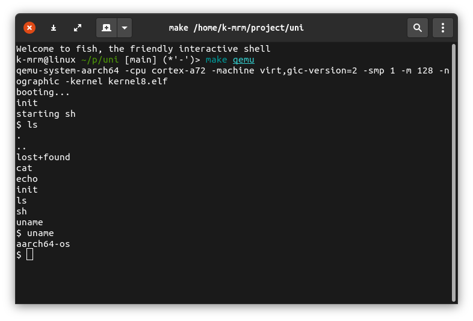

# aarch64-os

a simple OS for aarch64(qemu virt board)



## Features
- single processor
- multiprocessor
- preemptive multi tasking
- process scheduler
  - round-robin
- block device
  - virtio-blk
- file system
  - ext2
- UNIX-like syscalls
- isolation of address space by MMU
  - multiple address space
- command-line interface(sh)
- some core utils
  - ls, cat, echo etc...

## Required
- aarch64-linux-gnu-toolchain
- qemu-system-aarch64

## Build & Run

```
$ make qemu
```
specify the number of cores
```
$ make qemu NCPU=<ncore>
```

## License

MIT License
